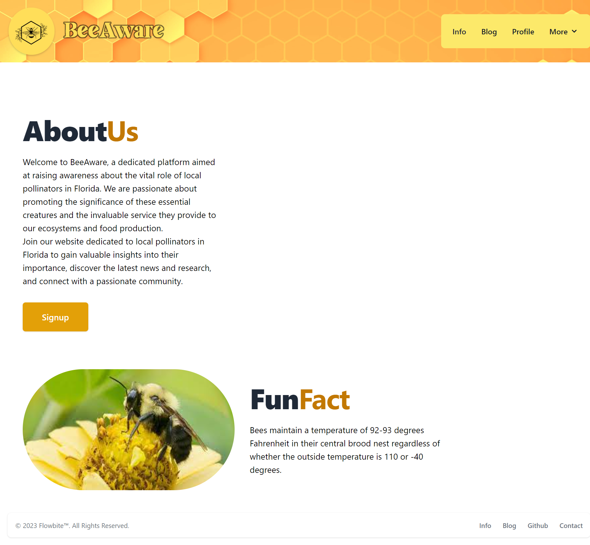

# BeeAware

[Visit live application](https://radiant-ocean-19328.herokuapp.com/)

## Description

BeeAware is a web application designed to educate users about bees and everything related to bees. It features various sections that provide valuable information and resources about bees, as well as interactive features for user engagement. The app is built using Node.js, Express, React, and MongoDB.

## Features

- **Forum**: Users can participate in discussions, share knowledge, and connect with other bee enthusiasts.
- **User Authentication**: Users can create an account, log in, and access personalized features.
- **Responsive Design**: The app is optimized for different devices and screen sizes.

## Usage

When on the home page you can navigate the site with the navbar on the upper right. Click sign up to create an account to start posting on the blog feed. Click on the info tab and see many different types of Florida local pollinators. All user posts can be edited and deleted on the profile page in the blog post feed.

## How to Contribute

To contribute please email any on the application contributors. Then push to your branch and request a merge to the main branch and we will review the new code.

## Questions

Here is the link to my Github profile https://github.com/jesseemerson7

please <a href="mailto:jesseemerson7@gmail.com">email me</a> about any questions regarding this project. Feel free to inform me of which repository you are referring to and I can get back to you as soon as possible.

## License

I used the MIT license for this project.

## Contributors
- Adam Abulkheir (@adamabulkheir)
- Ayden Lopez-Laclaustra (@aydenemateo)
- Alex Climenco (@AlexC3105)
- Jesse Emerson (@JesseEmerson7)
- Youlormans Hilaire (@youlormansH)

